# Architecture Diagrams

This document follows a practical industry-standard split:

- `System Context`
  Shows the system and the external actors around it
- `Container View`
  Shows the main deployable/runtime pieces
- `Sequence Diagrams`
  Show important request and event flows per functionality

This is intentionally better than one giant diagram. Large mixed diagrams become hard to read, hard to update, and low-signal during onboarding.

## 1. System Context

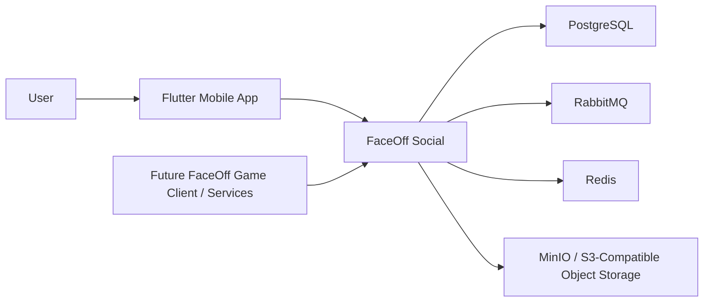

Use this when explaining:

- what FaceOff Social is
- what is inside the repo
- what is outside the repo
- where game integration will sit later

## 2. Container View

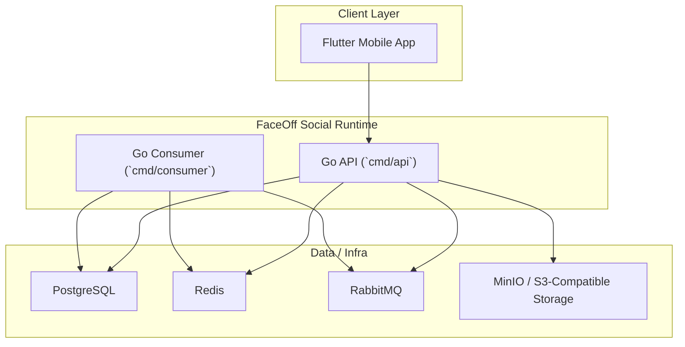

Notes:

- `API` owns synchronous mobile-facing flows
- `Consumer` is for asynchronous work and notification/event handling
- `MinIO` is used locally, but the storage adapter is S3-compatible

## 3. Domain View

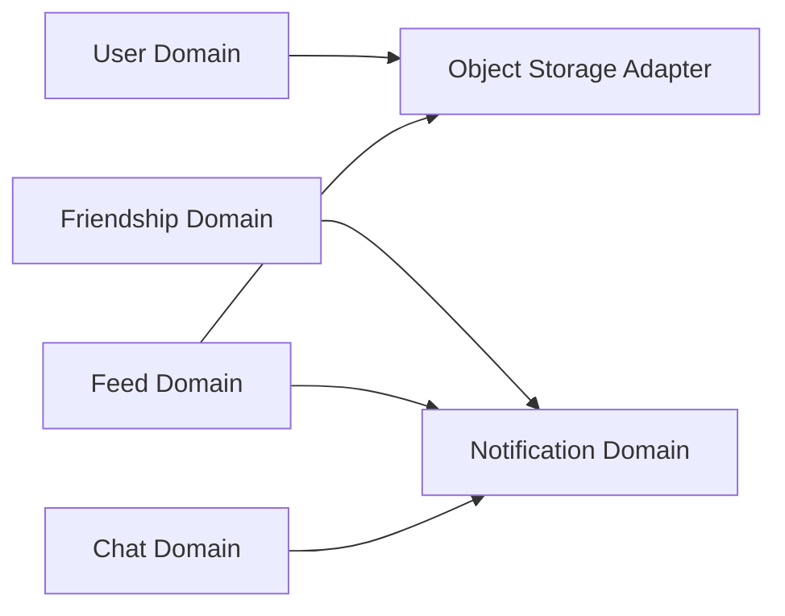

Use this to explain ownership:

- `user`
  signup, login, profile, avatar metadata
- `friendship`
  friend requests and accepted relationships
- `feed`
  posts, reactions, comments, replies, post media metadata
- `chat`
  conversations, messages, unread state
- `notification`
  in-app notification fanout and read state

## 4. Sequence: Sign Up With Avatar Upload

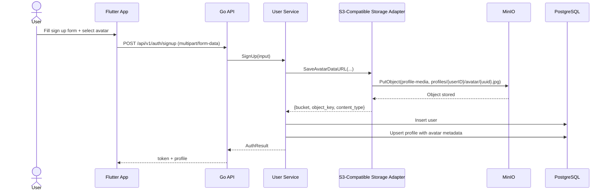

Key point:

- image bytes go to object storage
- metadata goes to PostgreSQL

## 5. Sequence: Create Feed Post With Image

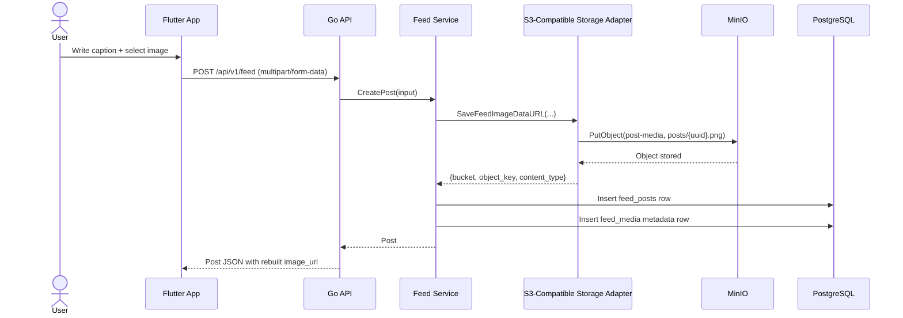

## 6. Sequence: Read Feed Post Image

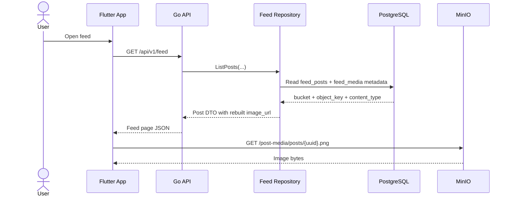

## 7. Sequence: Replace Avatar

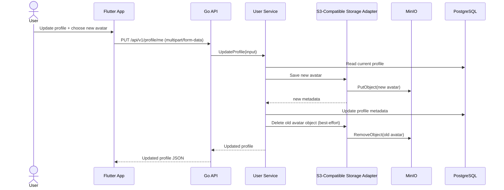

## 8. Sequence: Delete Post With Cleanup

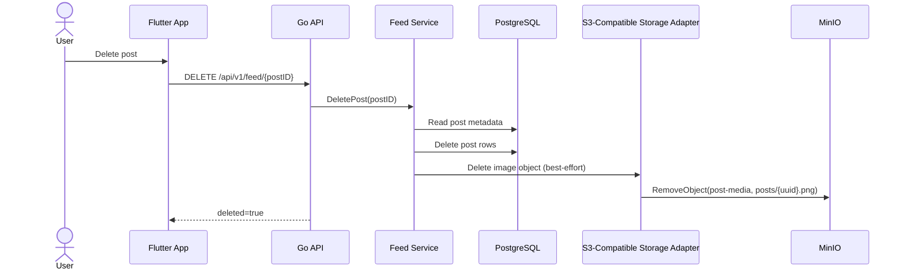

## 9. Sequence: Send Chat Message

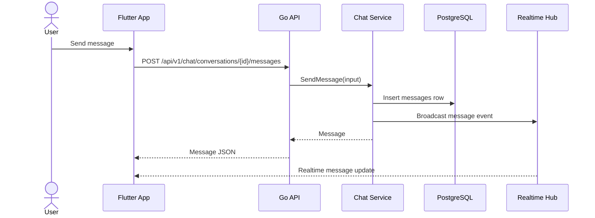

## 10. Sequence: Notification Fanout

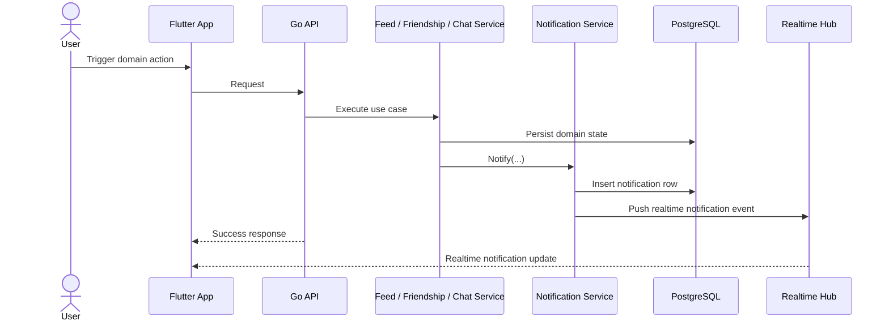

## 11. Sequence: Domain Event Flow

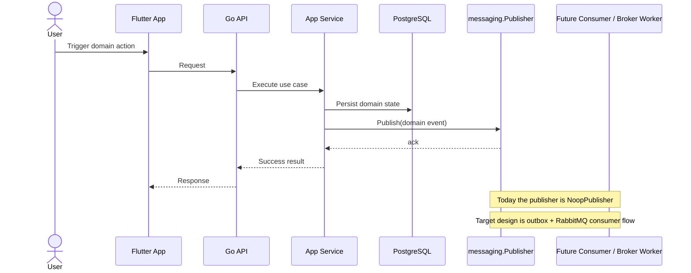

## Why This Split Is Better

- `Context diagram`
  Best for orientation
- `Container diagram`
  Best for runtime/deployment understanding
- `Sequence diagrams`
  Best for implementation and debugging

This is the pattern to keep using as features grow:

1. add one stable high-level view
2. add one sequence diagram per important use case
3. avoid mixing structure and behavior in one diagram
