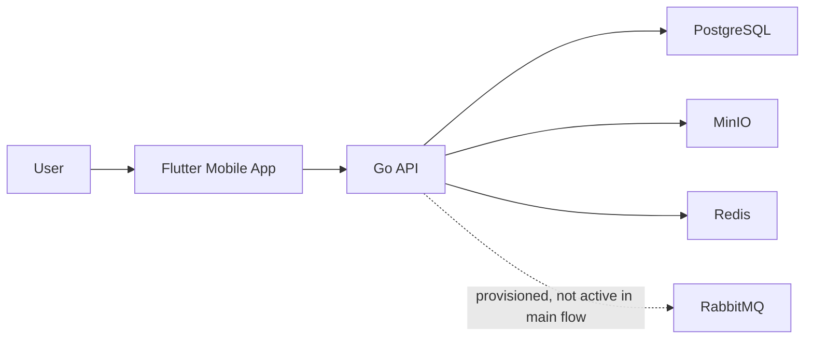
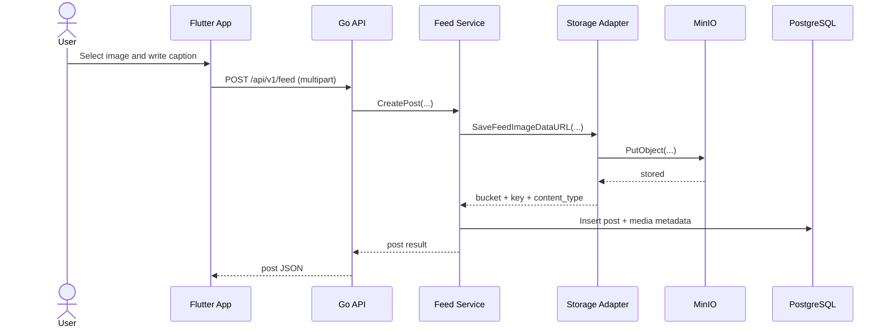
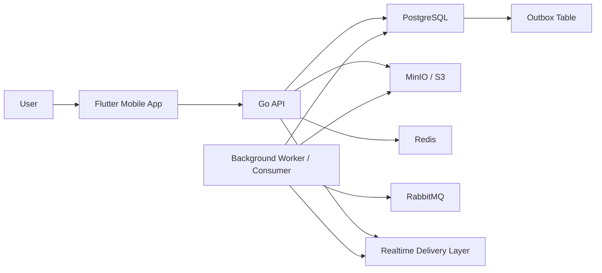
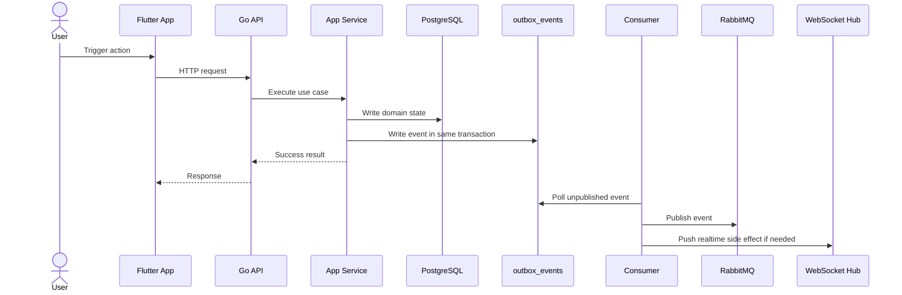

# Current vs Target System Design

This document is meant to teach system design using the current FaceOff Social codebase.

It does two things:

1. explains the current system as it really works today
2. explains an improved target system that is more production-ready

The goal is not to jump straight to a "big tech" architecture.

The goal is to understand:

- what exists now
- what problems it solves well
- what risks it still has
- what should be improved next

## 1. System Design Mindset

A useful system design review usually answers:

- who are the users?
- what are the main use cases?
- what components exist?
- where is the source of truth?
- what needs low latency?
- what can be asynchronous?
- what breaks first when load grows?
- how do we improve without overengineering?

For this repo, the main user-facing flows are:

- sign up and log in
- update profile
- upload avatar
- create post with image
- comment and reply
- chat with friends
- receive notifications

## 2. Current Setup

## 2.1 High-Level Shape

Current architecture:

- Flutter mobile app
- Go backend API
- Gin transport layer
- PostgreSQL
- MinIO
- Redis
- RabbitMQ
- Zap structured logs
- Prometheus
- Jaeger
- Loki
- Grafana
- WebSocket hub inside the API runtime

Important truth:

- RabbitMQ is present in infra
- but it is not yet part of the active application flow

## 2.2 Current System Context

## 2.3 Current Responsibilities

### Mobile App

- renders auth, feed, chat, profile, notifications
- sends HTTP requests to the API
- opens WebSocket connection for realtime updates
- uploads files to backend using multipart

### Go API

- authentication and profile logic
- friendship logic
- feed logic
- chat logic
- notification creation
- object storage orchestration
- realtime socket delivery
- request metrics exposure
- trace export
- structured JSON logging

### PostgreSQL

- source of truth for product data
- users, profiles, friendships
- feed posts, feed media metadata, comments
- conversations, messages, read state
- notifications

### MinIO

- stores actual image bytes
- avatars and post images

### Redis

- infrastructure support
- available for caching / transient state

### RabbitMQ

- provisioned as part of infra
- target event transport
- not yet actively used by the application flow

### Observability Stack

- Zap writes structured logs to `stdout`
- Promtail tails Docker container logs and ships them to Loki
- Prometheus scrapes `GET /metrics`
- OpenTelemetry exports traces to Jaeger over OTLP HTTP
- Grafana reads Prometheus, Loki, and Jaeger

## 2.4 Current Request Flow

Example: create feed post with image

## 2.5 Current Strengths

What the current setup does well:

- simple to understand
- fast to develop
- one main backend deployment unit
- single database source of truth
- object storage already separated from relational data
- media metadata model is clean
- multipart upload is better than base64 JSON
- realtime features work without extra distributed complexity
- observability baseline now exists locally

This is a strong setup for:

- MVP
- solo development
- early product iteration
- moderate traffic

## 2.6 Current Weaknesses

### 1. Events are not truly broker-backed

There is a publisher abstraction, but it currently uses:

- `NoopPublisher`

So:

- code emits domain events
- but those events are not actually transported through RabbitMQ

### 2. Realtime is tightly coupled to the API instance

Chat and notification realtime behavior currently depends on the in-process WebSocket hub.

That is fine for:

- local
- single instance
- early stage production

But harder for:

- multiple API instances
- horizontal scaling
- guaranteed cross-instance fanout

### 3. No outbox pattern yet

Today, state changes and event publishing are not protected by an outbox workflow.

Risk:

- DB write can succeed
- event publish can fail or be skipped
- side effects become inconsistent

### 4. Background work is still thin

Examples:

- image resizing is not separated
- retries are limited
- cleanup is best-effort
- no dedicated worker responsibilities yet

### 5. Media reads are public URL based

This is fine today, but later you may want:

- signed URLs
- private buckets
- CDN in front of object storage

### 6. Observability is baseline, not deep yet

Current observability is good enough for local visibility, but still thin for production operations.

Missing pieces:

- endpoint-level domain counters beyond generic HTTP metrics
- websocket-specific metrics
- richer trace spans across domain workflows
- dashboards and alerts
- log/trace correlation fields beyond request-level basics

## 3. Current Setup Summary

If you want a short system design statement for today:

> FaceOff Social currently uses a modular monolith backend with Gin for transport, PostgreSQL as the source of truth, MinIO for media storage, multipart uploads for user media, an in-process WebSocket hub for realtime chat and notification delivery, and a local observability stack built on Zap, Prometheus, Jaeger, Loki, and Grafana.

## 4. Target Setup

The target setup should improve reliability and scalability without throwing away the current modular monolith.

That means:

- keep the domain modules
- keep PostgreSQL
- keep object storage
- add a proper async event pipeline
- split synchronous and asynchronous work more clearly

## 4.1 Target High-Level Shape

## 4.2 Main Changes

### 1. Add outbox pattern

When a domain action succeeds:

- write business state
- write outbox event in the same DB transaction

Then:

- a worker reads unpublished outbox rows
- publishes to RabbitMQ
- marks them published

This is the standard fix for event consistency.

### 2. Use RabbitMQ for real async side effects

RabbitMQ should carry:

- notification fanout jobs
- media processing jobs
- future email/push work
- future cross-service integration work

### 3. Keep WebSocket delivery for connected users

RabbitMQ should not replace the WebSocket hub directly.

Better pattern:

- RabbitMQ distributes events between workers/instances
- each API instance pushes to the sockets it owns

This gives:

- horizontal scaling
- cross-instance realtime delivery
- less instance-local coupling

### 4. Add dedicated background worker responsibilities

Worker examples:

- notification dispatch
- outbox publish
- image thumbnail generation
- image compression
- orphan cleanup
- retryable side effects

### 5. Prepare for S3 migration without code redesign

Already partly done:

- storage uses S3-compatible adapter
- metadata is stored as bucket + key + content_type

So moving from MinIO to AWS S3 should be mostly config change, not architecture rewrite.

## 4.3 Target Event Flow

## 4.4 Target Media Flow

Later target:

- keep multipart for now
- optionally move to signed direct upload later

Future improved media flow:

1. mobile asks backend for upload intent
2. backend returns signed upload URL
3. mobile uploads directly to object storage
4. backend stores metadata after upload confirmation

This is useful when:

- files become larger
- backend bandwidth becomes expensive
- upload throughput becomes important

But it is not the first improvement to prioritize.

## 5. Current vs Target Comparison

| Area | Current | Target |
|---|---|---|
| API architecture | Modular monolith | Modular monolith |
| DB | PostgreSQL | PostgreSQL |
| Media storage | MinIO via S3-compatible adapter | MinIO or S3 via same adapter |
| Media upload | Multipart through backend | Multipart now, signed direct upload later |
| Realtime | In-process WebSocket hub | WebSocket hub + broker-assisted fanout |
| Events | Defined, but publisher is no-op | Outbox + RabbitMQ + worker |
| Async jobs | Minimal | Worker-driven background jobs |
| Scaling model | Good for single instance | Better for multiple instances |

## 6. Why Not Jump Straight To Microservices?

Because it would be the wrong tradeoff today.

Current repo size and product stage favor:

- clear modules
- one codebase
- one DB
- simpler debugging
- lower operational overhead

Microservices make sense later only if:

- deployment independence is truly needed
- team size grows
- scaling needs become domain-specific
- operational maturity is already strong

Right now, the better move is:

- strengthen the monolith
- improve event reliability
- improve background processing

## 7. Best Next System Design Improvements

If you want the highest-value improvements in order:

1. implement outbox pattern
2. replace `NoopPublisher` with real publish path
3. use RabbitMQ for async notifications and side effects
4. make realtime fanout cross-instance safe
5. add image processing workers
6. add signed direct upload only when needed

## 8. What You Should Learn From This Repo

This codebase is a good system design study because it shows a very common real-world path:

- start with a practical monolith
- separate object storage from DB early
- keep metadata modeled cleanly
- use realtime directly first
- add async reliability later
- avoid overengineering too early

That is a better engineering path than pretending a small app needs a huge distributed architecture on day one.
