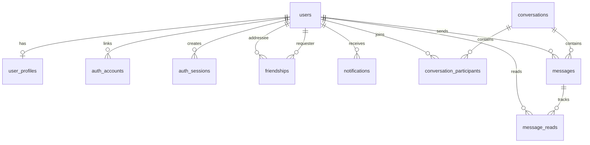

# Database ERD

The active FaceOff Social schema is intentionally small and centered on social identity, relationships, chat, and notifications.

## Active Table Groups
- `identity`: `users`, `user_profiles`, `auth_accounts`, `auth_sessions`
- `friendship`: `friendships`, `notifications`
- `chat`: `conversations`, `conversation_participants`, `messages`, `message_reads`
- `infrastructure`: `outbox_events`, `schema_migrations`

## Relationship Diagram

## Domain Notes

### Identity
- `users` stores account credentials and onboarding completion.
- `user_profiles` stores social-facing details only.
- future game-owned character and rank data should not be added here as source-of-truth fields.

### Friendship And Notifications
- `friendships` models friend request state and accepted connections.
- `notifications` models inbox behavior and can outlive the original action state.

### Chat
- `conversations` is the parent thread.
- `conversation_participants` models membership.
- `messages` stores message bodies and sender information.
- `message_reads` tracks read state per user.

### Infrastructure
- `outbox_events` supports future async event publishing.
- `schema_migrations` is created by the migrator and tracks applied SQL files.
