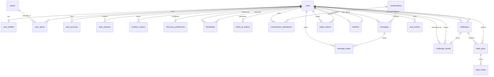

# Database ERD

The current initial schema defines **22 application tables** across:
- [000001_init.sql](/Users/gerommebeligon/WorkSpace/portfolio-projects/chat-system/migrations/000001_init.sql)
- [000002_sports_catalog.sql](/Users/gerommebeligon/WorkSpace/portfolio-projects/chat-system/migrations/000002_sports_catalog.sql)

When the migration container runs, it also creates:
- `schema_migrations`

So in a real running local database, expect **23 total tables** after the first migration cycle completes.

## Table Count By Area
- `catalog`: `sports`
- `user`: `users`, `user_profiles`, `user_sports`, `auth_accounts`, `auth_sessions`, `location_scopes`
- `friendship`: `friendships`, `friend_qr_tokens`
- `chat`: `conversations`, `conversation_participants`, `messages`, `message_reads`
- `discovery`: `discovery_preferences`, `swipe_actions`, `matches`
- `challenge`: `challenges`, `challenge_results`
- `feed`: `feed_posts`, `feed_media`
- `ranking`: `rank_entries`
- `infrastructure`: `outbox_events`, `schema_migrations`

## Relationship Diagram

## Domain Notes

### User And Identity
- `users` is the core identity table.
- `user_profiles` is a one-to-one extension for display-facing profile data.
- `user_sports` supports a one-to-many list of sports a user plays, referenced by `sport_id`.
- `auth_accounts` supports future social login provider bindings.
- `auth_sessions` supports session/token lifecycle persistence.
- `location_scopes` stores geography and optional coordinates used for local discovery and rankings.
- `discovery_preferences` is effectively a one-to-one settings table for visibility and search radius.

### Catalog
- `sports` is the canonical list of supported sports in the product.
- It provides stable IDs and slugs for profile selection, discovery filters, challenge creation, and rankings.
- This table should be treated as reference data seeded through migrations.

### Friendship
- `friendships` links one user to another with directional request semantics:
  requester -> addressee
- `friend_qr_tokens` holds shareable QR-based add-friend tokens.

### Chat
- `conversations` is the parent chat thread.
- `conversation_participants` is the join table between users and conversations.
- `messages` belongs to a conversation and has one sender.
- `message_reads` is the read-tracking join table between users and messages.

### Discovery
- `swipe_actions` records directional interest decisions by sport.
- `matches` records mutual outcomes between two users for a specific sport.
- `discovery_preferences` controls visibility and search behavior, but it is still anchored to `users`.

### Challenge
- `challenges` records who challenged whom, in what sport, and with what status.
- `challenge_results` is currently modeled as one-to-one with `challenges`.
- `challenge_results.winner_user_id` is nullable so the challenge can exist before a winner is recorded.

### Feed
- `feed_posts` belongs to an author and may optionally reference a challenge.
- `feed_media` is a one-to-many child of `feed_posts`.

### Ranking
- `rank_entries` stores points by user, sport, and geography scope.
- It is intentionally denormalized around scope fields because ranking queries will be read-heavy.

### Infrastructure
- `outbox_events` is the future-safe bridge for reliable event publishing.
- `schema_migrations` is created by the migration container and tracks which SQL files already ran.

## Important Relationship Patterns
- One-to-one:
  `users -> user_profiles`
  `users -> discovery_preferences`
  `challenges -> challenge_results`
- One-to-many:
  `sports -> user_sports`
  `users -> auth_sessions`
  `users -> auth_accounts`
  `users -> user_sports`
  `conversations -> messages`
  `feed_posts -> feed_media`
- Many-to-many through join tables:
  `users <-> conversations` through `conversation_participants`
  `users <-> messages` read state through `message_reads`

## Notes For Future Changes
- `friendships`, `matches`, and `challenges` all model relationships between users, but they serve different business meanings and should remain separate.
- `location_scopes` may eventually be split into privacy-safe coarse location and internal precise coordinates if discovery logic becomes more sensitive.
- `rank_entries` may later move to precomputed leaderboard tables or snapshots if ranking queries become expensive at scale.
- `outbox_events` should remain infrastructure-owned even if modules split into separate services later.
